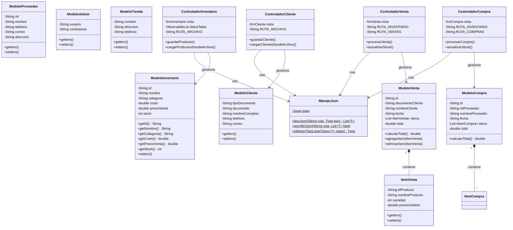
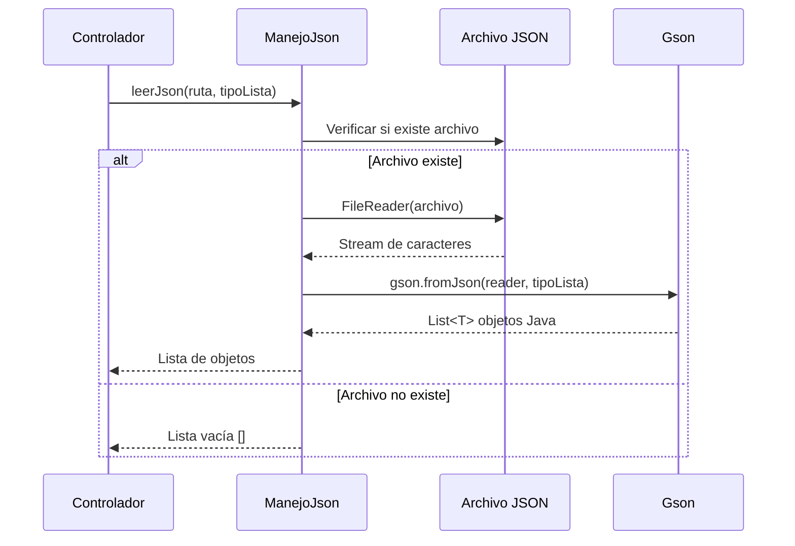
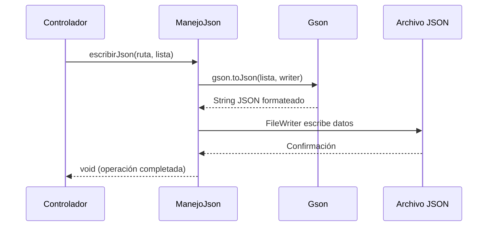

# Manual del Programador - Sistema de Gestión de Licorera

## 1. Arquitectura del Sistema

### 1.1 Diagrama de Clases (UML)



### 1.2 Explicación de Paquetes y Clases

El proyecto sigue el patrón de arquitectura **MVC (Modelo-Vista-Controlador)** organizado en los siguientes paquetes:

#### 📦 Paquete `model`

Contiene las clases que representan los datos del sistema y los archivos JSON de persistencia.

| Clase              | Descripción                        | Archivo JSON        |
| ------------------ | ---------------------------------- | ------------------- |
| `ModeloInventario` | Productos del inventario (licores) | `tbInventario.json` |
| `ModeloCliente`    | Clientes de la tienda              | `tbCliente.json`    |
| `ModeloProveedor`  | Proveedores de productos           | `tbProveedor.json`  |
| `ModeloVenta`      | Registro de ventas realizadas      | `tbVenta.json`      |
| `ModeloCompra`     | Registro de compras a proveedores  | `tbCompra.json`     |
| `ModeloAdmin`      | Usuarios administradores           | `tbAdmin.json`      |
| `ModeloTienda`     | Información de la tienda           | `tbTienda.json`     |

#### 📦 Paquete `view`

Contiene las interfaces gráficas (formularios) construidas con **JavaFX**.

| Clase           | Descripción                  |
| --------------- | ---------------------------- |
| `frmInicio`     | Pantalla de inicio de sesión |
| `frmPrincipal`  | Menú principal del sistema   |
| `frmInventario` | Gestión de productos         |
| `frmCliente`    | Gestión de clientes          |
| `frmProveedor`  | Gestión de proveedores       |
| `frmVenta`      | Registro de ventas           |
| `frmCompra`     | Registro de compras          |
| `frmHistorial`  | Historial de transacciones   |
| `frmUsuarios`   | Gestión de usuarios          |
| `frmRegistro`   | Registro de nuevos usuarios  |

#### 📦 Paquete `controller`

Contiene la lógica de negocio que conecta las vistas con los modelos.

| Clase                   | Responsabilidad                             |
| ----------------------- | ------------------------------------------- |
| `ControladorInicio`     | Validación de credenciales                  |
| `ControladorPrincipal`  | Navegación entre módulos                    |
| `ControladorInventario` | CRUD de productos                           |
| `ControladorCliente`    | CRUD de clientes                            |
| `ControladorProveedor`  | CRUD de proveedores                         |
| `ControladorVenta`      | Proceso de ventas y actualización de stock  |
| `ControladorCompra`     | Proceso de compras y actualización de stock |
| `ControladorHistorial`  | Consulta de transacciones                   |
| `ControladorUsuarios`   | CRUD de usuarios                            |
| `ControladorRegistro`   | Registro de nuevos usuarios                 |

#### 📦 Paquete `files`

Contiene utilidades para el manejo de archivos.

| Clase        | Responsabilidad                                  |
| ------------ | ------------------------------------------------ |
| `ManejoJson` | Lectura y escritura de archivos JSON usando Gson |

---

## 2. Tecnologías Usadas

| Tecnología  | Versión | Uso                                                 |
| ----------- | ------- | --------------------------------------------------- |
| **Java SE** | 17      | Lenguaje de programación principal                  |
| **JavaFX**  | 21.0.2  | Framework para interfaz gráfica de usuario          |
| **Gson**    | 2.10.1  | Biblioteca para serialización/deserialización JSON  |
| **Maven**   | -       | Gestión de dependencias y construcción del proyecto |

### Dependencias (pom.xml)

```xml
<dependencies>
    <!-- JavaFX Controls -->
    <dependency>
        <groupId>org.openjfx</groupId>
        <artifactId>javafx-controls</artifactId>
        <version>21.0.2</version>
    </dependency>

    <!-- JavaFX FXML -->
    <dependency>
        <groupId>org.openjfx</groupId>
        <artifactId>javafx-fxml</artifactId>
        <version>21.0.2</version>
    </dependency>

    <!-- Gson para JSON -->
    <dependency>
        <groupId>com.google.code.gson</groupId>
        <artifactId>gson</artifactId>
        <version>2.10.1</version>
    </dependency>
</dependencies>
```

---

## 3. Flujo de Datos

### 3.1 Lectura de Archivo JSON



### 3.2 Escritura de Archivo JSON



### 3.3 Código de Lectura

```java
// Obtener el tipo de lista genérica
Type tipoLista = ManejoJson.obtenerTipoLista(ModeloInventario.class);

// Leer productos desde el archivo JSON
List<ModeloInventario> productos = ManejoJson.leerJson(
    "src/main/java/model/tbInventario.json",
    tipoLista
);
```

### 3.4 Código de Escritura

```java
// Agregar nuevo producto a la lista
productos.add(nuevoProducto);

// Guardar la lista completa en el archivo JSON
ManejoJson.escribirJson("src/main/java/model/tbInventario.json", productos);
```

---

## 4. Instrucciones para Compilar

### 4.1 Usando Maven (Recomendado)

```bash
# Compilar el proyecto
mvn clean compile

# Ejecutar la aplicación
mvn javafx:run

# Crear paquete ejecutable
mvn clean package
```

### 4.2 Usando Comandos Manuales (javac/java)

```bash
# Navegar al directorio del proyecto
cd Proyecto-Licorera

# Compilar todos los archivos Java
javac -d target/classes src/main/java/**/*.java

# Ejecutar la aplicación (requiere JavaFX en el classpath)
java --module-path "ruta/a/javafx-sdk/lib" --add-modules javafx.controls,javafx.fxml -cp target/classes App
```

### 4.3 Usando IDE (IntelliJ IDEA / VS Code)

1. Abrir el proyecto desde el archivo `pom.xml`
2. Esperar a que Maven descargue las dependencias
3. Ejecutar la clase principal `App.java`
4. O usar el comando: `Maven > Plugins > javafx > javafx:run`

---

## 5. Explicación del CRUD

### 5.1 Crear (Create)

```java
// Ejemplo: Agregar un nuevo producto al inventario
public void guardarProducto() {
    // 1. Validar datos del formulario
    String nombre = vista.getTxtNombre().getText().trim();
    // ... más validaciones

    // 2. Leer lista actual desde JSON
    Type tipoLista = ManejoJson.obtenerTipoLista(ModeloInventario.class);
    List<ModeloInventario> listaProductos = ManejoJson.leerJson(RUTA_ARCHIVO, tipoLista);

    // 3. Verificar que no exista duplicado
    boolean existe = listaProductos.stream()
            .anyMatch(p -> p.getNombre().equalsIgnoreCase(nombre));

    // 4. Crear nuevo objeto y agregarlo a la lista
    String idProducto = generarIdProducto(listaProductos.size());
    ModeloInventario producto = new ModeloInventario(idProducto, nombre, categoria, precio, stock);
    listaProductos.add(producto);

    // 5. Guardar lista actualizada en JSON
    ManejoJson.escribirJson(RUTA_ARCHIVO, listaProductos);
}
```

### 5.2 Leer (Read)

```java
// Ejemplo: Cargar todos los productos del inventario
public void cargarProductosDesdeArchivo() {
    // 1. Obtener el tipo de lista
    Type tipoLista = ManejoJson.obtenerTipoLista(ModeloInventario.class);

    // 2. Leer los datos desde JSON
    List<ModeloInventario> listaProductos = ManejoJson.leerJson(RUTA_ARCHIVO, tipoLista);

    // 3. Mostrar en la tabla de la interfaz
    for (ModeloInventario p : listaProductos) {
        datosTabla.add(new String[] {
            p.getId(),
            p.getNombre(),
            p.getCategoria(),
            String.format("$%.2f", p.getCosto()),
            String.format("$%.2f", p.getPrecioVenta()),
            String.valueOf(p.getStock())
        });
    }
}
```

### 5.3 Actualizar (Update)

```java
// Ejemplo: Actualizar stock de un producto después de una venta
public void actualizarStock(String idProducto, int cantidadVendida) {
    // 1. Leer productos actuales
    Type tipoLista = ManejoJson.obtenerTipoLista(ModeloInventario.class);
    List<ModeloInventario> productos = ManejoJson.leerJson(RUTA_INVENTARIO, tipoLista);

    // 2. Buscar y modificar el producto
    for (ModeloInventario p : productos) {
        if (p.getId().equals(idProducto)) {
            int nuevoStock = p.getStock() - cantidadVendida;
            p.setStock(nuevoStock);
            break;
        }
    }

    // 3. Guardar lista modificada
    ManejoJson.escribirJson(RUTA_INVENTARIO, productos);
}
```

### 5.4 Eliminar (Delete)

```java
// Ejemplo: Eliminar un cliente por su documento
public void eliminarCliente(String documento) {
    // 1. Leer clientes actuales
    Type tipoLista = ManejoJson.obtenerTipoLista(ModeloCliente.class);
    List<ModeloCliente> clientes = ManejoJson.leerJson(RUTA_CLIENTES, tipoLista);

    // 2. Filtrar la lista excluyendo el cliente a eliminar
    clientes.removeIf(c -> c.getDocumento().equals(documento));

    // 3. Guardar lista actualizada
    ManejoJson.escribirJson(RUTA_CLIENTES, clientes);
}
```

---

## 6. Ejemplo de Archivos JSON

### 6.1 Inventario (tbInventario.json)

```json
[
  {
    "id": "PROD-001",
    "nombre": "Aguardiente Antioqueño Sin Azúcar 750ml",
    "categoria": "Aguardiente",
    "costo": 28000.0,
    "precioVenta": 42000.0,
    "stock": 13
  },
  {
    "id": "PROD-002",
    "nombre": "Whisky Buchanans Deluxe 12 Años 750ml",
    "categoria": "Whisky",
    "costo": 120000.0,
    "precioVenta": 180000.0,
    "stock": 11
  }
]
```

### 6.2 Clientes (tbCliente.json)

```json
[
  {
    "tipoDocumento": "CC",
    "documento": "1234567890",
    "nombreCompleto": "Juan Pérez García",
    "telefono": "3001234567",
    "correo": "juan.perez@email.com"
  }
]
```

### 6.3 Ventas (tbVenta.json)

```json
[
  {
    "id": "VEN-001",
    "documentoCliente": "1234567890",
    "nombreCliente": "Juan Pérez García",
    "fecha": "2024-12-10 15:30:00",
    "items": [
      {
        "idProducto": "PROD-001",
        "nombreProducto": "Aguardiente Antioqueño 750ml",
        "cantidad": 2,
        "precioUnitario": 42000.0
      }
    ],
    "total": 84000.0
  }
]
```

### 6.4 Proveedores (tbProveedor.json)

```json
[
  {
    "nit": "900123456-7",
    "nombre": "Distribuidora Nacional de Licores",
    "telefono": "6012345678",
    "correo": "ventas@distribuidora.com",
    "direccion": "Cra 15 #45-67, Bogotá"
  }
]
```

---

## 7. Estructura del Proyecto

```
Proyecto-Licorera/
├── pom.xml                          # Configuración Maven
├── src/
│   └── main/
│       └── java/
│           ├── App.java             # Clase principal (punto de entrada)
│           ├── controller/          # Controladores (lógica de negocio)
│           │   ├── ControladorCliente.java
│           │   ├── ControladorCompra.java
│           │   ├── ControladorHistorial.java
│           │   ├── ControladorInicio.java
│           │   ├── ControladorInventario.java
│           │   ├── ControladorPrincipal.java
│           │   ├── ControladorProveedor.java
│           │   ├── ControladorRegistro.java
│           │   ├── ControladorUsuarios.java
│           │   └── ControladorVenta.java
│           ├── files/               # Utilidades de archivos
│           │   └── ManejoJson.java
│           ├── model/               # Modelos de datos y archivos JSON
│           │   ├── ModeloAdmin.java
│           │   ├── ModeloCliente.java
│           │   ├── ModeloCompra.java
│           │   ├── ModeloInventario.java
│           │   ├── ModeloProveedor.java
│           │   ├── ModeloTienda.java
│           │   ├── ModeloVenta.java
│           │   ├── tbAdmin.json
│           │   ├── tbCliente.json
│           │   ├── tbCompra.json
│           │   ├── tbInventario.json
│           │   ├── tbProveedor.json
│           │   ├── tbTienda.json
│           │   └── tbVenta.json
│           └── view/                # Interfaces gráficas (JavaFX)
│               ├── frmCliente.java
│               ├── frmCompra.java
│               ├── frmHistorial.java
│               ├── frmInicio.java
│               ├── frmInventario.java
│               ├── frmPrincipal.java
│               ├── frmProveedor.java
│               ├── frmRegistro.java
│               ├── frmUsuarios.java
│               └── frmVenta.java
├── img/                             # Recursos de imágenes
└── target/                          # Archivos compilados
```

---

## 8. Notas Adicionales

### Convenciones de Nomenclatura

- **Modelos**: Prefijo `Modelo` (ej: `ModeloCliente`)
- **Vistas**: Prefijo `frm` (ej: `frmCliente`)
- **Controladores**: Prefijo `Controlador` (ej: `ControladorCliente`)
- **Archivos JSON**: Prefijo `tb` (ej: `tbCliente.json`)
- **IDs de productos**: Formato `PROD-###` (ej: `PROD-001`)
- **IDs de ventas**: Formato `VEN-###` (ej: `VEN-001`)

### Precio de Venta

El sistema calcula automáticamente el precio de venta aplicando un **50% de ganancia** sobre el costo de compra:

```java
this.precioVenta = costo * 1.5;
```

### Manejo de Errores

El sistema maneja errores de lectura/escritura JSON de forma silenciosa, retornando listas vacías en caso de fallo para evitar interrumpir la aplicación.
