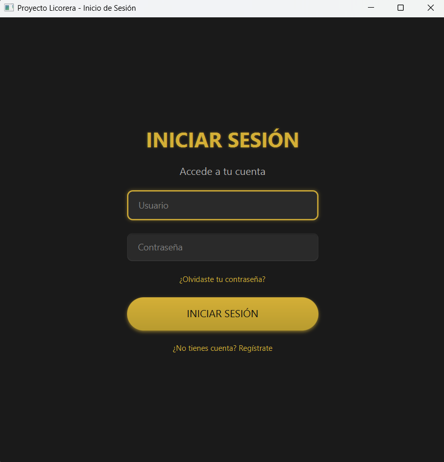
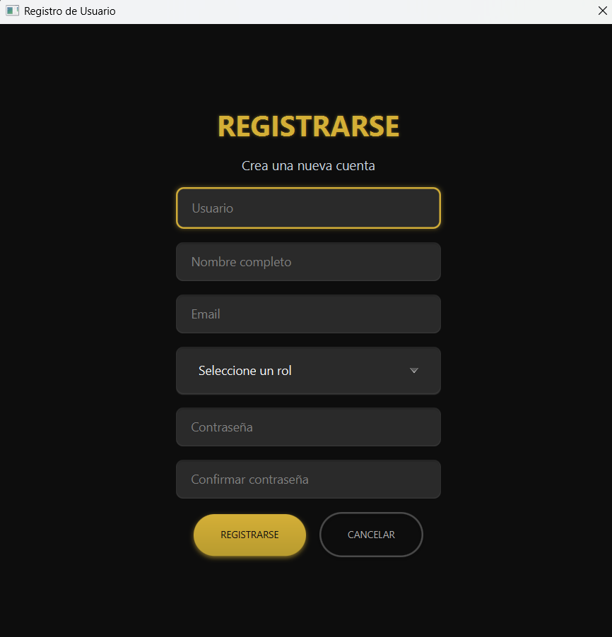
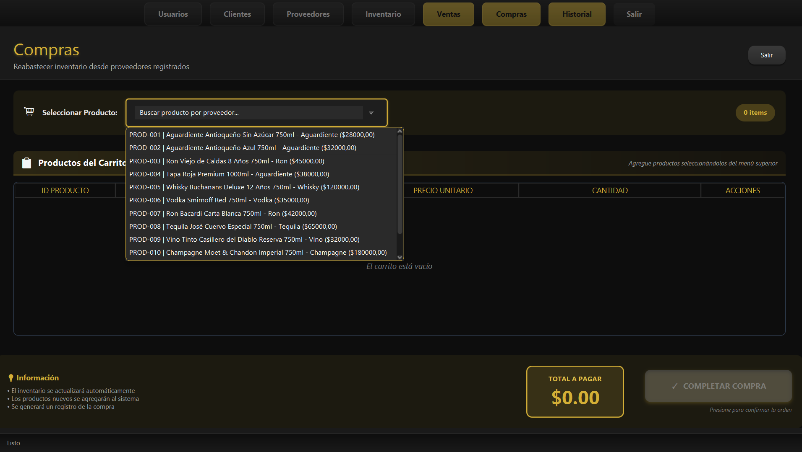
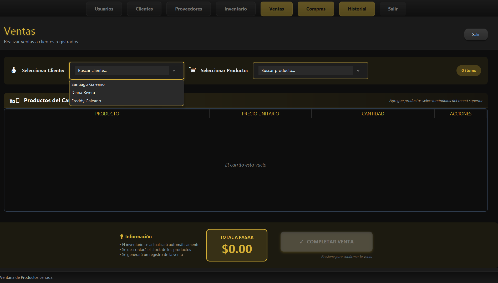
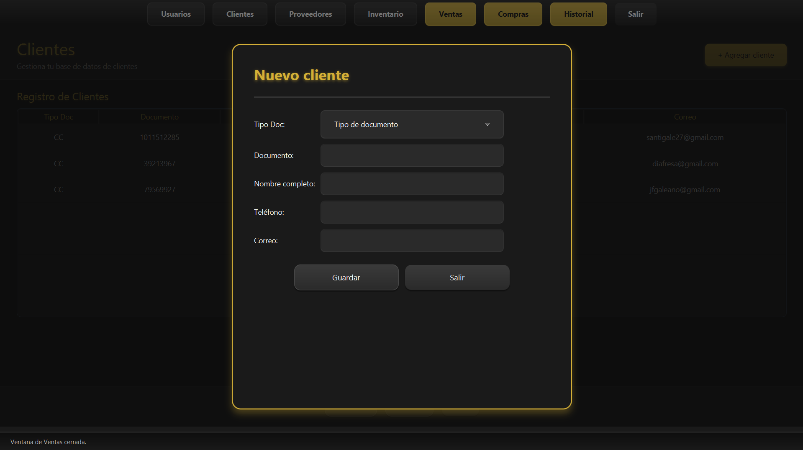
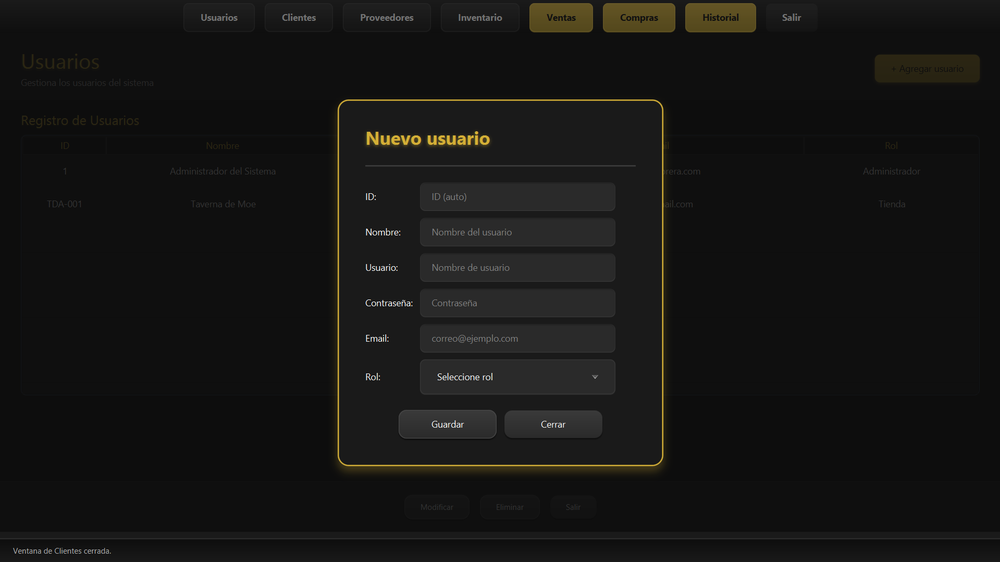
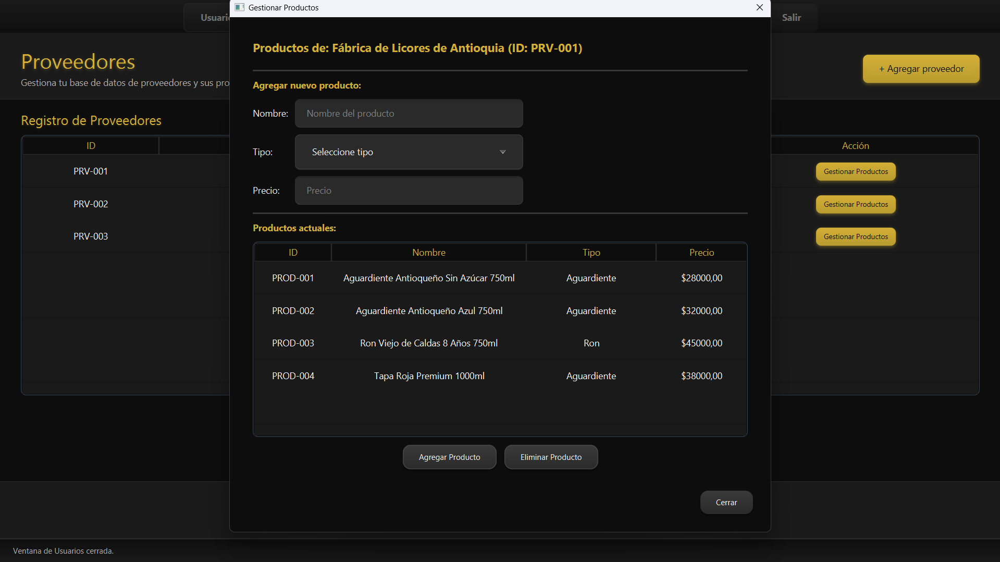
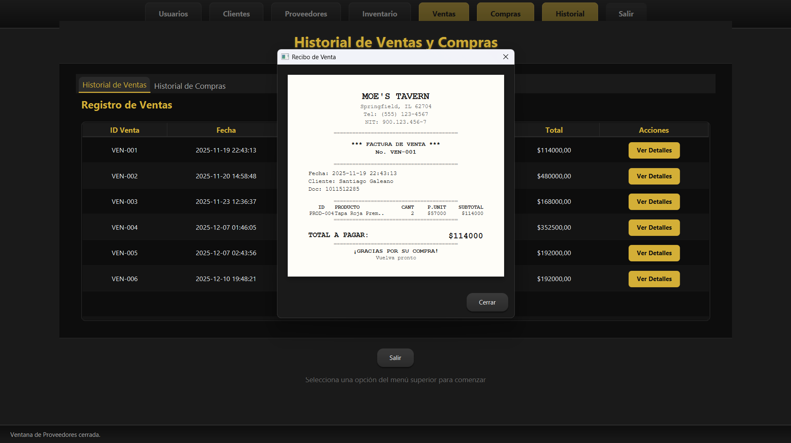

# 📘 Manual de Usuario

## Sistema de Gestión de Licorera

---

## 📋 Portada

**Nombre del Proyecto:** Sistema de Gestión de Licorera

**Autor(es):** [Santiago Galeano y Sofia Franco]

**Versión:** 1.0

**Fecha:** Diciembre 2024

---

## 📖 Introducción

### Descripción del Sistema

El Sistema de Gestión de Licorera es una aplicación de escritorio desarrollada en JavaFX que permite administrar de manera eficiente las operaciones diarias de una licorera. El sistema proporciona las siguientes funcionalidades principales:

- **Gestión de Usuarios:** Control de acceso con diferentes roles (Administrador, Tienda)
- **Gestión de Clientes:** Registro y consulta de información de clientes
- **Gestión de Productos:** Control de inventario de licores
- **Gestión de Ventas:** Registro y seguimiento de transacciones comerciales

El sistema utiliza una interfaz gráfica moderna con tema oscuro profesional, diseñada para ser intuitiva y eficiente en el uso diario.

---

## 🔧 Requisitos del Sistema

### Requisitos de Software

| Componente                         | Especificación Mínima                          | Recomendado                              |
| ---------------------------------- | ---------------------------------------------- | ---------------------------------------- |
| **Sistema Operativo**              | Windows 10, macOS 10.14, Linux (Ubuntu 18.04+) | Windows 11, macOS 12+, Linux actualizado |
| **Java Runtime Environment (JRE)** | Java 17 o superior                             | Java 21                                  |
| **Memoria RAM**                    | 2 GB                                           | 4 GB o más                               |
| **Espacio en Disco**               | 200 MB libres                                  | 500 MB libres                            |
| **Resolución de Pantalla**         | 1280x720 píxeles                               | 1920x1080 píxeles                        |

### Librerías Utilizadas

- **JavaFX 17+**: Framework de interfaz gráfica
- **Gson 2.10+**: Manejo de archivos JSON para persistencia de datos
- **JDK 17+**: Kit de desarrollo de Java

---

## 🚀 Instalación y Ejecución

### Opción 1: Ejecutar desde archivo JAR

#### Paso 1: Verificar instalación de Java

Abra una terminal o símbolo del sistema y ejecute:

```bash
java -version
```

Debe mostrar Java 17 o superior. Si no está instalado, descárguelo desde:

- **Oracle JDK**: https://www.oracle.com/java/technologies/downloads/
- **OpenJDK**: https://adoptium.net/

#### Paso 2: Ejecutar la aplicación

1. Descargue el archivo `licorera-sistema.jar`
2. Navegue hasta la carpeta donde descargó el archivo
3. Ejecute el siguiente comando:

```bash
java -jar licorera-sistema.jar
```

**En Windows:** También puede hacer doble clic sobre el archivo `.jar` si tiene Java correctamente configurado.

### Opción 2: Ejecutar desde código fuente

#### Paso 1: Requisitos previos

- Instale **Maven** o **Gradle** (gestor de dependencias)
- Instale **Git** (control de versiones)

#### Paso 2: Clonar el repositorio

```bash
git clone [URL_DEL_REPOSITORIO]
cd proyecto-licorera
```

#### Paso 3: Compilar y ejecutar

**Con Maven:**

```bash
mvn clean install
mvn javafx:run
```

**Con Gradle:**

```bash
gradle build
gradle run
```

### Verificación de Instalación Exitosa

Si la instalación fue exitosa, verá la **pantalla de inicio de sesión** con los siguientes elementos:

- Campo de texto para "Usuario"
- Campo de contraseña para "Contraseña"
- Botón "INICIAR SESIÓN"
- Enlaces de "¿Olvidaste tu contraseña?" y "¿No tienes cuenta? Regístrate"

---

## 👤 Acceso al Sistema

### Credenciales por Defecto

Para acceder por primera vez al sistema, utilice las siguientes credenciales de administrador:



```
Usuario: admin
Contraseña: aaaaaa
```

### Registro de Nuevos Usuarios

Si no tiene cuenta, puede registrarse siguiendo estos pasos:

1. En la pantalla de inicio de sesión, haga clic en **"¿No tienes cuenta? Regístrate"**
2. Complete el formulario con la siguiente información:
   - **Usuario:** Nombre único de usuario
   - **Nombre completo:** Su nombre real
   - **Email:** Correo electrónico válido
   - **Rol:** Seleccione "Administrador" o "Tienda"
   - **Contraseña:** Mínimo 6 caracteres
   - **Confirmar contraseña:** Repita la contraseña
3. Haga clic en **"REGISTRARSE"**
4. Si el registro es exitoso, podrá iniciar sesión con sus credenciales


---

## 🎯 Guía Paso a Paso

---

## 📦 1. Cómo Agregar Productos al Inventario

Los productos se agregan al inventario a través del módulo de **Compras** a proveedores. Primero debe existir un proveedor con productos asociados.

### Pasos para agregar productos al inventario:

1. **Acceda al sistema** con sus credenciales
2. En la barra de navegación, haga clic en **"Compras"**
3. En la ventana de compras:
   - Seleccione un producto del combo desplegable (muestra productos por proveedor)
   - El producto se agrega automáticamente al carrito con cantidad 1
   - Use los botones **+** y **−** para ajustar la cantidad
4. Revise el **Total a Pagar** en la parte inferior
5. Haga clic en **"✓ COMPLETAR COMPRA"**
6. El stock se actualizará automáticamente en el inventario

### Ejemplo de producto en el inventario:

```json
{
  "id": "PROD-003",
  "nombre": "Ron Viejo de Caldas 8 Años 750ml",
  "categoria": "Ron",
  "costo": 45000.0,
  "precioVenta": 67500.0,
  "stock": 9
}
```


---

## ✏️ 2. Cómo Ver y Gestionar el Inventario

### Acceder al Inventario

1. En la barra de navegación, haga clic en **"Inventario"**
2. Se mostrará la lista completa de productos disponibles


### Información Mostrada

La tabla de inventario muestra:

| Columna          | Descripción                        |
| ---------------- | ---------------------------------- |
| **ID**           | Identificador único (ej: PROD-001) |
| **Nombre**       | Nombre completo del producto       |
| **Categoría**    | Tipo de bebida (Ron, Whisky, etc.) |
| **Costo**        | Precio de compra al proveedor      |
| **Precio Venta** | Precio de venta al público         |
| **Stock**        | Cantidad disponible en inventario  |

### Agregar Nuevo Producto al Inventario

1. En la ventana de inventario, haga clic en **"+ Agregar Producto"**
2. Complete el formulario:
   - **Nombre:** Nombre del producto (incluya presentación, ej: "Whisky 750ml")
   - **Categoría:** Seleccione el tipo de licor
   - **Costo:** Precio de adquisición
   - **Precio:** Precio de venta al público
   - **Stock:** Cantidad inicial
3. Haga clic en **"Guardar"**

---

## 🛒 3. Cómo Realizar una Venta

### Pasos para realizar una venta:

1. En la barra de navegación, haga clic en **"Ventas"** (botón destacado)
2. **Seleccione el cliente:**
   - Use el combo "Seleccionar Cliente" para buscar un cliente registrado
   - El cliente debe estar registrado previamente en el módulo de Clientes
3. **Agregue productos al carrito:**
   - Use el combo "Seleccionar Producto" para buscar productos
   - El producto se agrega con cantidad 1
   - Use los botones **+** y **−** para ajustar la cantidad
   - Use el botón **🗑 Eliminar** para quitar productos del carrito
4. **Revise la venta:**
   - El contador de items se muestra arriba a la derecha
   - El **TOTAL A PAGAR** se calcula automáticamente
5. Haga clic en **"✓ COMPLETAR VENTA"**
6. El sistema:
   - Descuenta el stock de los productos
   - Genera un registro de la venta
   - Muestra confirmación de éxito



### Información importante:

- El inventario se actualiza automáticamente
- Se generará un registro en el historial de ventas
- Puede ver las ventas realizadas en el módulo **Historial**

---

## 👥 4. Gestión de Clientes

### Agregar un Cliente

1. En la pantalla principal, haga clic en **"Nuevo Cliente"**
2. Complete el formulario con los siguientes datos:

   **Campos Obligatorios:**

   - **Tipo de Documento:** Seleccione CC, NIT o CE
   - **Número de Documento:** Solo números (ej: 1011512285)
   - **Nombre Completo:** Nombre del cliente o razón social
   - **Tipo de Cliente:** Normal o Empresa

   **Campos Opcionales:**

   - **Teléfono:** Solo números (ej: 3126361815)
   - **Correo Electrónico:** Email válido (ej: cliente@ejemplo.com)

3. Haga clic en **"Guardar"**
4. El cliente aparecerá en la tabla inferior



### Ejemplo de Cliente Normal

```
Tipo de Documento: CC
Documento: 1011512285
Nombre Completo: Santiago Galeano
Teléfono: 3126361815
Correo: santigale27@gmail.com
Tipo de Cliente: Normal
```

### Ejemplo de Cliente Empresa

```
Tipo de Documento: NIT
Documento: 900123456
Nombre Completo: Licorería El Buen Gusto S.A.S
Teléfono: 6012345678
Correo: ventas@elbuentgusto.com
Tipo de Cliente: Empresa
```

### Validaciones del Sistema

El sistema validará automáticamente:

✅ **Documento único:** No puede haber dos clientes con el mismo documento  
✅ **Formato de correo:** Debe tener @ y dominio válido  
✅ **Solo números:** En campos de documento y teléfono  
✅ **Campos obligatorios:** No puede dejar campos requeridos vacíos

Si hay errores, verá un mensaje descriptivo como:

```
⚠️ Validación
Ya existe un cliente con ese número de documento.
```

### Consultar Clientes

La tabla de clientes muestra toda la información registrada:

| Tipo Doc | Documento  | Nombre Completo  | Teléfono   | Correo                | Tipo Cliente |
| -------- | ---------- | ---------------- | ---------- | --------------------- | ------------ |
| CC       | 1011512285 | Santiago Galeano | 3126361815 | santigale27@gmail.com | Normal       |

### Cerrar la Ventana

Haga clic en **"Salir"** en la parte inferior para regresar al menú principal.

---

## 👨‍💼 5. Gestión de Usuarios (Solo Administradores)

### Acceder al Módulo

1. Inicie sesión con una cuenta de **Administrador**
2. En la pantalla principal, haga clic en **"Administrar Usuarios"**
3. Se abrirá la ventana de gestión de usuarios

### Agregar un Usuario



1. Complete el formulario superior:

   **Campos Requeridos:**

   - **Nombre:** Nombre completo del usuario
   - **Usuario:** Nombre de usuario para login (único)
   - **Contraseña:** Clave de acceso
   - **Email:** Correo electrónico válido
   - **Rol:** Seleccione "Administrador" o "Tienda"

2. Haga clic en **"Guardar"**
3. El usuario aparecerá en la tabla

### Modificar un Usuario

1. En la tabla, haga clic sobre el usuario que desea modificar
2. Los datos se cargarán en el formulario
3. Modifique los campos necesarios
4. **Nota:** Puede dejar el campo de contraseña vacío si no desea cambiarla
5. Haga clic en **"Modificar"**

### Eliminar un Usuario

1. Seleccione el usuario en la tabla
2. Haga clic en **"Eliminar"**
3. Confirme la acción en el diálogo:
   ```
   ¿Está seguro de eliminar este usuario?
   Usuario: D1 (Tiendas D1)
   ```
4. Haga clic en **"OK"** para confirmar


⚠️ **Advertencia:** No puede eliminar el usuario con el que está conectado actualmente.

### Roles del Sistema

| Rol               | Permisos                                                                                                               |
| ----------------- | ---------------------------------------------------------------------------------------------------------------------- |
| **Administrador** | - Gestionar usuarios<br>- Gestionar clientes<br>- Gestionar productos<br>- Realizar ventas<br>- Ver reportes completos |
| **Tienda**        | - Gestionar clientes<br>- Realizar ventas<br>- Consultar inventario<br>- Ver reportes básicos                          |

### Ejemplo de Usuario

```
ID: [generado automáticamente]
Nombre: Tiendas D1
Usuario: D1
Contraseña: ******
Email: tiendasd1@gmail.com
Rol: Tienda
```

---

## 🏭 6. Gestión de Proveedores

### Acceder al Módulo

1. En la barra de navegación, haga clic en **"Proveedores"**
2. Se abrirá la ventana de gestión de proveedores

### Agregar un Proveedor

1. Haga clic en **"+ Agregar Proveedor"**
2. Complete el formulario:
   - **ID:** Identificador único (ej: PRV-001)
   - **Nombre:** Nombre de la empresa proveedora
3. Haga clic en **"Guardar"**

### Gestionar Productos del Proveedor

Cada proveedor tiene una lista de productos que ofrece:

1. En la tabla de proveedores, haga clic en el botón **"Productos"** de la fila deseada
2. Se mostrará la ventana de gestión de productos del proveedor
3. Puede agregar productos con:
   - **ID Producto:** Identificador único (ej: PROD-005)
   - **Nombre:** Nombre completo del producto
   - **Tipo:** Categoría del licor
   - **Precio:** Precio de compra al proveedor



### Ejemplo de Proveedor:

```json
{
  "id": "PRV-001",
  "nombre": "Fábrica de Licores de Antioquia",
  "productos": [
    {
      "id": "PROD-001",
      "nombre": "Aguardiente Antioqueño Sin Azúcar 750ml",
      "tipo": "Aguardiente",
      "precio": 28000.0
    }
  ]
}
```

---

## 🛍️ 7. Gestión de Compras (Reabastecimiento)

### Acceder al Módulo

1. En la barra de navegación, haga clic en **"Compras"**
2. Se abrirá la ventana de gestión de compras

### Realizar una Compra a Proveedores

1. **Seleccione un producto:**
   - Use el combo "Seleccionar Producto" (muestra productos de todos los proveedores)
   - El producto se agrega al carrito con cantidad 1
2. **Ajuste la cantidad:**
   - Use los botones **+** y **−** o escriba directamente
   - Rango permitido: 1-999 unidades
3. **Revise el carrito:**
   - Tabla con ID Producto, Nombre, Precio Unitario, Cantidad
   - Contador de items arriba a la derecha
4. **Complete la compra:**
   - Verifique el **TOTAL A PAGAR**
   - Haga clic en **"✓ COMPLETAR COMPRA"**

### Resultado de la Compra:

- ✅ El inventario se actualiza automáticamente agregando el stock
- ✅ Los productos nuevos se crean en el inventario
- ✅ Se genera un registro en el historial de compras

---

## 📜 8. Historial de Transacciones

### Acceder al Módulo

1. En la barra de navegación, haga clic en **"Historial"**
2. Se abrirá una ventana con dos pestañas

### Pestaña "Ventas"

Muestra todas las ventas realizadas con:

| Columna      | Descripción                         |
| ------------ | ----------------------------------- |
| **ID**       | Identificador de la venta (VEN-XXX) |
| **Cliente**  | Nombre del cliente                  |
| **Fecha**    | Fecha y hora de la venta            |
| **Total**    | Monto total de la venta             |
| **Acciones** | Botón para ver detalles             |



### Pestaña "Compras"

Muestra todas las compras a proveedores con:

| Columna       | Descripción                          |
| ------------- | ------------------------------------ |
| **ID**        | Identificador de la compra (COM-XXX) |
| **Proveedor** | Nombre del proveedor                 |
| **Fecha**     | Fecha y hora de la compra            |
| **Total**     | Monto total de la compra             |
| **Acciones**  | Botón para ver detalles              |

### Ver Detalles de una Transacción

1. Haga clic en **"Ver Detalles"** en la fila deseada
2. Se mostrará un recibo con:
   - Información del cliente/proveedor
   - Lista de productos con cantidades y precios
   - Total de la transacción

---

## 🎨 Interfaz del Sistema

### Pantalla de Inicio de Sesión

**Elementos:**

- Título: "INICIAR SESIÓN"
- Subtítulo: "Accede a tu cuenta"
- Campo de usuario
- Campo de contraseña
- Enlace de recuperación
- Botón de inicio de sesión
- Enlace de registro

**Tema:** Oscuro con acentos azules (#3b82f6)

### Pantalla Principal

**Estructura:**

- **Barra de Navegación Superior:**

  - Usuarios (gestión de usuarios del sistema)
  - Clientes (gestión de clientes)
  - Proveedores (gestión de proveedores y sus productos)
  - Inventario (ver y gestionar stock de productos)
  - Ventas (destacado - realizar ventas a clientes)
  - Compras (destacado - comprar productos a proveedores)
  - Historial (destacado - ver historial de transacciones)
  - Salir (rojo)

- **Área Central:**

  - Mensaje de bienvenida con logo de "MOE'S TAVERN"
  - Contenido dinámico según la opción seleccionada

- **Barra de Estado Inferior:**
  - Mensajes del sistema
  - Estado de la última acción

### Ventanas Modales

Las ventanas de gestión (Usuarios, Clientes) tienen:

- **Sección Superior:** Formulario de entrada
- **Sección Central:** Tabla de datos
- **Sección Inferior:** Botones de acción

---

## ⌨️ Atajos de Teclado

| Acción                 | Atajo                              |
| ---------------------- | ---------------------------------- |
| Iniciar sesión         | `Enter` (en campo de contraseña)   |
| Registrarse            | `Enter` (en campo de confirmación) |

---

## 🗂️ Archivos de Datos

El sistema almacena la información en archivos JSON ubicados en:

```
src/main/java/model/
├── tbAdmin.json       → Usuarios Administradores
├── tbCliente.json     → Clientes registrados
├── tbProveedor.json   → Proveedores y sus productos disponibles
├── tbInventario.json  → Inventario de productos en stock
├── tbVenta.json       → Historial de ventas realizadas
├── tbCompra.json      → Historial de compras a proveedores
└── tbTienda.json      → Usuarios de Tiendas
```

### Formato de tbAdmin.json

```json
[
  {
    "id": "1",
    "usuario": "admin",
    "contrasena": "aaaaaa",
    "nombre": "Administrador del Sistema",
    "rol": "Administrador",
    "email": "admin@licorera.com"
  }
]
```

### Formato de tbCliente.json

```json
[
  {
    "tipoDocumento": "CC",
    "documento": "1011512285",
    "nombreCompleto": "Santiago Galeano",
    "telefono": "3126361815",
    "correo": "santigale27@gmail.com",
    "tipoCliente": "Normal"
  }
]
```

---

## 🔒 Seguridad y Respaldos

### Recomendaciones de Seguridad

1. **Cambie la contraseña por defecto** del administrador inmediatamente
2. **Use contraseñas seguras:** Mínimo 8 caracteres con letras, números y símbolos
3. **No comparta credenciales** entre usuarios
4. **Cierre sesión** cuando termine de usar el sistema
5. **Revise los usuarios** periódicamente y elimine cuentas inactivas

### Respaldo de Datos

Para respaldar los datos del sistema:

1. Localice la carpeta `src/main/java/model/`
2. Copie los archivos `.json` a una ubicación segura
3. Nombre el respaldo con la fecha: `respaldo_2024-12-10.zip`

**Frecuencia recomendada:** Diaria o después de cambios importantes

### Restaurar Datos

1. Cierre la aplicación
2. Reemplace los archivos `.json` con los del respaldo
3. Reinicie la aplicación

---

## ❓ Solución de Problemas

### Problema: La aplicación no inicia

**Causa:** Java no instalado o versión incorrecta

**Solución:**

1. Verifique la instalación: `java -version`
2. Descargue Java 17+ desde https://adoptium.net/
3. Reinicie la computadora después de instalar

---

### Problema: No puedo iniciar sesión

**Causa:** Credenciales incorrectas o archivo de datos corrupto

**Solución:**

1. Verifique que está usando: `admin` / `aaaaaa`
2. Revise que el archivo `tbAdmin.json` existe
3. Si el problema persiste, restaure el archivo desde un respaldo

---

### Problema: Los cambios no se guardan

**Causa:** Permisos de escritura insuficientes

**Solución:**

1. Ejecute la aplicación como administrador (clic derecho → Ejecutar como administrador)
2. Verifique que la carpeta `model/` no esté en solo lectura
3. Compruebe que tiene espacio disponible en disco

---

### Problema: La ventana se ve cortada o muy grande

**Causa:** Resolución de pantalla incompatible o DPI alto

**Solución:**

1. Ajuste la escala del sistema al 100%
2. Use una resolución mínima de 1280x720
3. En Windows: Configuración → Sistema → Pantalla → Escala

---

### Problema: "Error al cargar datos" al abrir una ventana

**Causa:** Archivo JSON corrupto o con formato incorrecto

**Solución:**

1. Abra el archivo JSON correspondiente con un editor de texto
2. Verifique que tenga el formato correcto (ver sección "Archivos de Datos")
3. Si está vacío, agregue: `[]`
4. Si está corrupto, restaure desde un respaldo

---

### Información Requerida para Soporte

Cuando contacte a soporte, proporcione:

1. **Versión del sistema:** 1.0
2. **Sistema operativo:** Windows/macOS/Linux y versión
3. **Versión de Java:** Resultado de `java -version`
4. **Descripción del problema:** Detallada y paso a paso
5. **Captura de pantalla:** Si es posible
6. **Mensaje de error:** Texto completo del error

---

## 📚 Glosario

| Término          | Definición                                              |
| ---------------- | ------------------------------------------------------- |
| **JavaFX**       | Framework de Java para crear interfaces gráficas        |
| **JSON**         | Formato de archivo para almacenar datos estructurados   |
| **Modal**        | Ventana que bloquea la interacción con otras ventanas   |
| **CRUD**         | Crear, Leer, Actualizar, Eliminar (operaciones básicas) |
| **Stage**        | Ventana independiente en JavaFX                         |
| **Scene**        | Contenido visual de una ventana                         |
| **Persistencia** | Almacenamiento permanente de datos                      |

---

## 📄 Historial de Versiones

### Versión 1.0 (Diciembre 2024)

**Funcionalidades Implementadas:**

- ✅ Sistema de autenticación (login/registro)
- ✅ Gestión de usuarios (CRUD completo)
- ✅ Gestión de clientes (CRUD completo con edición y eliminación)
- ✅ Gestión de proveedores (CRUD completo con productos asociados)
- ✅ Gestión de inventario (visualización y gestión de stock)
- ✅ Módulo de ventas (carrito, selección de cliente, procesamiento)
- ✅ Módulo de compras (reabastecimiento desde proveedores)
- ✅ Historial de transacciones (ventas y compras con recibos)
- ✅ Interfaz gráfica con tema oscuro profesional
- ✅ Persistencia de datos en JSON
- ✅ Validaciones de formularios
- ✅ Control de permisos por rol (Administrador/Tienda)

**Funcionalidades Pendientes:**

- ⏳ Reportes y estadísticas
- ⏳ Recuperación de contraseña
- ⏳ Exportación de datos a Excel/PDF
- ⏳ Filtros de búsqueda avanzados

---

## 📖 Licencia y Términos de Uso

Este software es propiedad de [Nombre de la Empresa/Desarrollador].

**Derechos de Uso:**

- ✅ Uso comercial permitido con licencia válida
- ✅ Modificación del software prohibida sin autorización
- ✅ Redistribución no permitida

**Limitación de Responsabilidad:**
El software se proporciona "tal cual" sin garantías. El desarrollador no se hace responsable de pérdidas de datos o daños derivados del uso del sistema.

---

## 🎓 Conclusión

Este manual ha cubierto todos los aspectos esenciales para utilizar el Sistema de Gestión de Licorera. Si tiene dudas adicionales o necesita asistencia personalizada, no dude en contactar al equipo de soporte.

**¡Gracias por usar nuestro sistema!** 🍾

---

**Documento creado:** Diciembre 2024  
**Última actualización:** Diciembre 2024  
**Versión del manual:** 1.0
